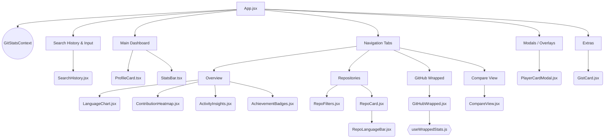

# 🏗️ Git-Stats System Architecture

Welcome to the architectural overview for **Git-Stats**, an advanced GitHub Profile Analyzer built to provide deep, visually engaging insights into any developer's public footprint.

---

## 🌟 Tech Stack Layering

- **Core Framework**: React 18 (Client-side rendering with mixed JSX/TSX support)
- **Build Tooling**: Vite 5 (HMR and fast ES-module bundling)
- **Styling**: Tailwind CSS 3 (Utility-first styling, fully responsive, persistent dark mode)
- **Data Visualization**: Recharts (Interactive SVG charts for language stats & heatmaps)
- **Data Source**: GitHub REST API v3
- **Export & Rendering**: `html2canvas` (for downloading the Player Card / Wrapped stats)

---

## 📂 Advanced Component Hierarchy

The application follows a highly modular, component-driven design localized within `src/components/`, utilizing a robust Context API for global state.

### 🧩 Core Component Roles

1. **`App.jsx`**: The root orchestrator. It acts as the primary layout wrapper and handles tab switching.
2. **`GitStatsContext.jsx`**: The centralized state container providing global access to `searchQuery`, `userData`, `reposData`, `loading`, and `error` states without prop drilling.
3. **Dashboard Components**:
   - `ProfileCard.tsx`: Displays core user metadata (Avatar, Bio, Follower counts) in a typed interface.
   - `StatsBar.tsx`: A numeric dashboard showcasing aggregate statistics.
4. **Data Visualization**:
   - `LanguageChart.jsx`: Integrates with `recharts` for an interactive language donut chart.
   - `ContributionHeatmap.jsx`: Visualizes commit patterns over time.
   - `ActivityInsights.jsx` & `AchievementBadges.jsx`: Gamified insights based on repo data.
5. **Interactive Modules**:
   - `GitHubWrapped.jsx`: A Spotify-style year-in-review for a developer, powered by `useWrappedStats.js`.
   - `PlayerCardModal.jsx`: Uses `html2canvas` to render and download a shareable developer "trading card."
   - `CompareView.jsx`: Side-by-side analysis of two distinct GitHub accounts.

---

## 🔄 Data Flow & State Management

1. **Global Context**: State is managed via `GitStatsContext.jsx`, eliminating deeply nested prop drilling.
2. **Fetch Lifecycle**:
   - User inputs a GitHub handle.
   - Context triggers parallel HTTP GET requests to:
     - `/users/{username}` (Profile)
     - `/users/{username}/repos` (Repositories)
     - `/users/{username}/gists` (Gists - mapped to `GistCard.jsx`)
3. **Custom Hooks**:
   - `useCountUp.js`: Drives smooth numeric animations in the UI.
   - `useWrappedStats.js`: Pure data transformation hook that calculates insights exclusively for the `GitHubWrapped.jsx` view.

---

## 🎨 Theming, Styling & Animations

- Styling is handled exclusively through **Tailwind CSS**.
- Complex transitions and responsive reflows are orchestrated via Tailwind classes.
- Persistent Dark Mode is supported natively.
